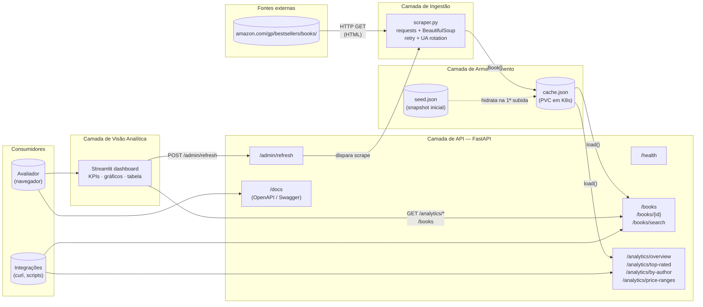
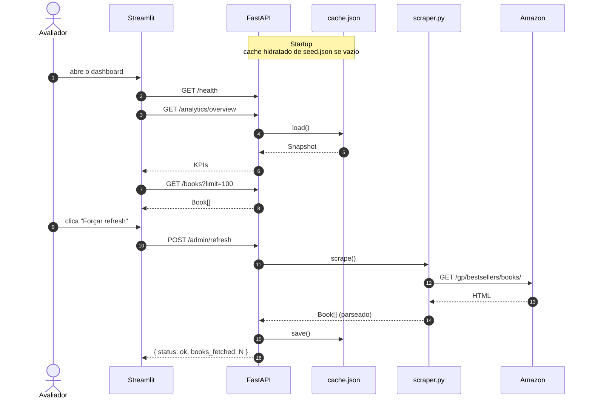

# Arquitetura — Amazon Best Sellers API

Entregável da **Prova Substitutiva — Fase 1** do MBA Machine Learning Engineering (FIAP).
Documento descreve o pipeline de **ingestão → armazenamento → API → visão analítica**.

## Visão geral

## Componentes

### 1. Ingestão — `api/app/scraper.py`
- Cliente HTTP `requests` com **User-Agent rotativo** e cabeçalhos de browser real.
- **Retries com backoff exponencial** (3 tentativas) e detecção heurística de CAPTCHA.
- Parsing **defensivo** com `BeautifulSoup` + `lxml`: múltiplos seletores de fallback porque a Amazon rotaciona nomes de classes.
- Extrai os 4 campos exigidos pelo enunciado: **título, autor, avaliação, preço** (+ reviews, URL e capa quando disponíveis).
- Acionado sob demanda via `POST /admin/refresh` — não há ingestão em request-time para não acoplar a disponibilidade da API à da Amazon.

### 2. Armazenamento — `api/app/cache.py`
- Arquivo **JSON local** (`cache.json`) montado como **PersistentVolumeClaim** no K8s para sobreviver a restarts.
- Seed embutido em `seed.json`: garante que a API funcione com dados realistas mesmo se a Amazon bloquear o primeiro scrape.
- Escrita **atômica** via `os.replace` (`cache.json.tmp` → `cache.json`) para evitar leitura de arquivo parcialmente escrito.
- Snapshot em memória protegido por `threading.Lock`.

### 3. API — FastAPI (`api/app/main.py`)
- **Documentação automática** em `/docs` (Swagger UI) e `/redoc` — atende o requisito "Documentação da API" sem trabalho extra.
- **Validação** via Pydantic v2: cada resposta é tipada (`Book`, `Overview`, `AuthorCount`, `PriceBucket`).
- Routers organizados por contexto:
  - `routers/books.py` — listagem, busca, detalhe
  - `routers/analytics.py` — agregações para a visão analítica
  - `routers/admin.py` — operação (refresh)
- **Health check** `/health` consumido pelas probes do K8s.
- CORS aberto para que o dashboard (e qualquer ferramenta) consuma a API.

### 4. Visão analítica — Streamlit (`dashboard/app.py`)
- Consome a API por HTTP (env var `API_URL`).
- 4 abas: **Top avaliados · Autores · Preços · Lista completa**.
- KPIs no topo: total, avaliação média, preço médio, faixa de preço, autores únicos.
- Botão lateral dispara `POST /admin/refresh` na API.

## Fluxo de dados (sequência)

## Variáveis de ambiente

| Variável | Onde | Default | Função |
|---|---|---|---|
| `LOG_LEVEL` | API | `INFO` | Nível de log do uvicorn/app |
| `DATA_DIR` | API | `app/data` | Diretório onde o cache JSON é gravado (montado no PVC) |
| `API_URL` | Dashboard | `http://localhost:8000` | URL base da API consumida pelo Streamlit |
